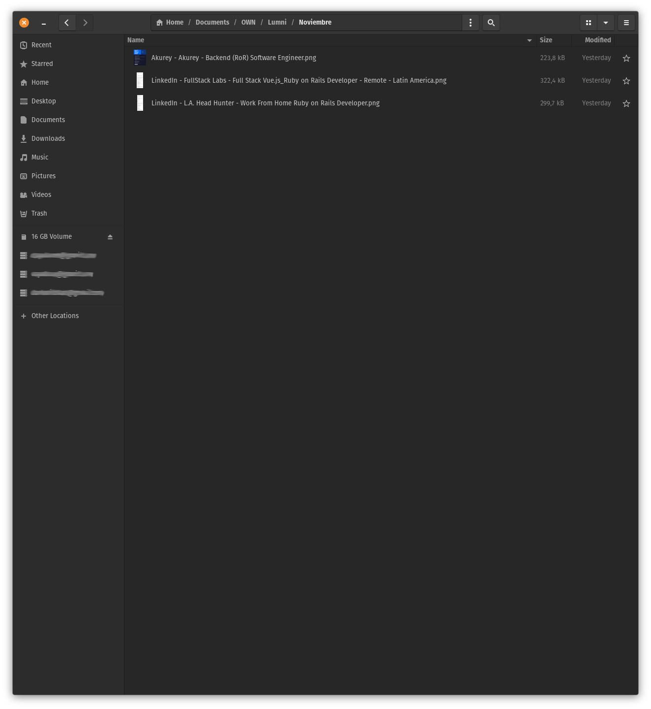
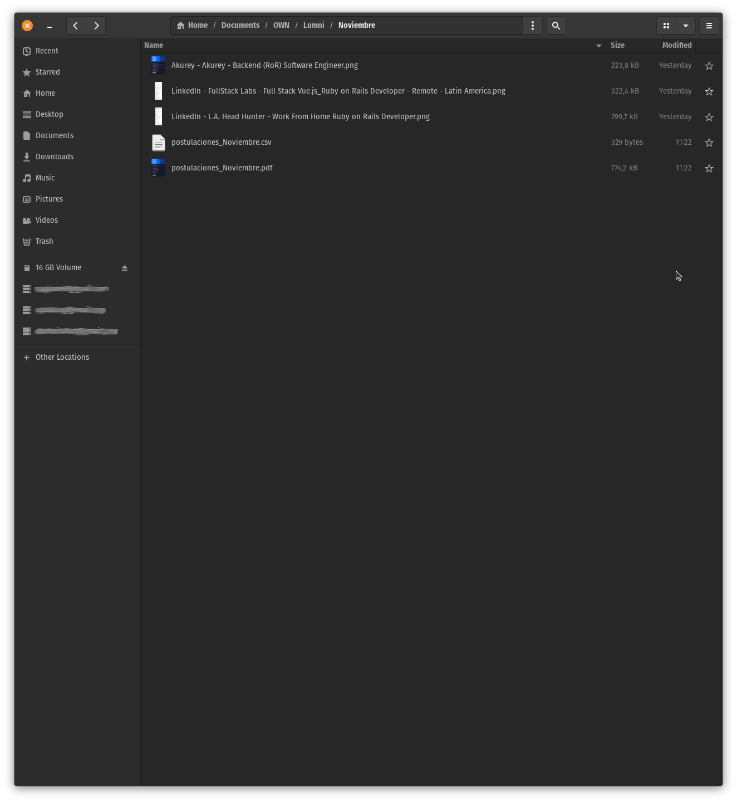

# JobApplication - CLI
## Resume
Makes easy the creation of a table that details all the job applications done during the current month. Export all the prepared images into a unique PDF that contains in order, all the files.

Preparing these files: the spreadsheet and the PDF, is quite repetitive, boring and idiotic.

## Details
Images names must follow this format:

```
Platform - Company - Position.png
```

also the images have to be processed (renamed, trimmed) the same day they are snapshotted from the web. As the script uses this date for the CSV file.

The CSV format is as follow:

| Fecha | Posición | Compañia | Plataforma | Estado |
|-------|----------|----------|------------|--------|
| 2024-10-09 | Fullstack developer | Avenue Code | LinkedIn | en proceso |


## Progress
- [x] read file system and generate CSV file sorted by date
- [x] generate unique pdf file with all the images in sorted by data
- [x] generated pdf has the images in order
- [ ] clean code, with help from [Ruby channel in Discord](https://discord.com/invite/6agKfnAY)

## Requirements(linux)
- Ruby, currently running version 2.7.3
- img2pdf (required for turning images into PDF), currently running version 0.4.2

run the following to install the required gem:
```console
bundle install
```

## How to run the script
The syntax to run the script is:   

```console
ruby lumni.rb /path/of/interest
```

inside that path, the necessary PNG files have to be available.

Here an example of the syntax, I have tried this in a Linux machine, and it will, probably, work the same for MacOS.

```console
ruby lumni.rb ~/Documents/OWN/Lumni/Noviembre
```

this will create the file: `postulaciones_Noviembre.csv` and `postulaciones_Noviembre.pdf` inside the described path.


directory with the images before running the script


directory with the images after running the script

## Important
This is still a work in progress, as many improvements can be made and many foolproof measures have to be considerated.

## Comments
- The gem [Prawn](https://prawnpdf.org/) can be used to export the images into a PDF file, but it has a rigid page size, so I chose to use a system utility like `img2pdf` (ImageMagick's convert is another possibility but required extra configuration).
